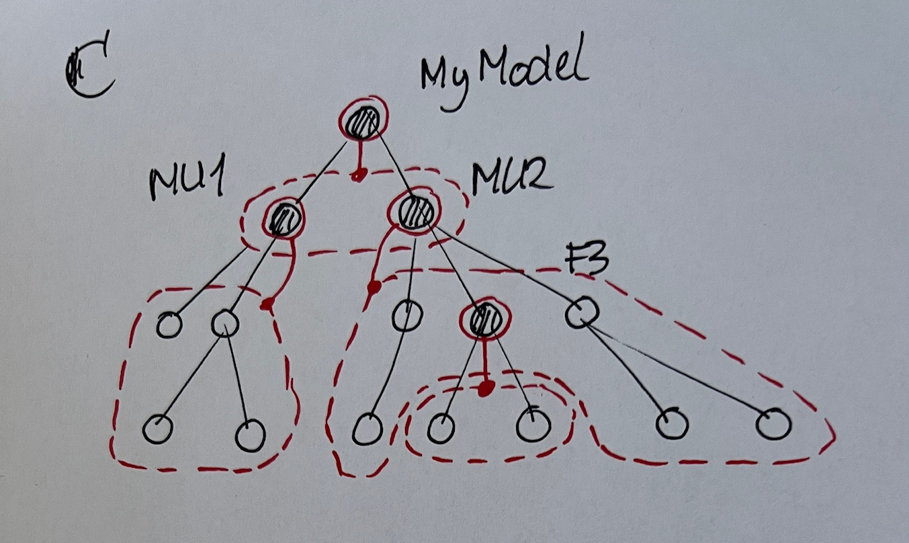

this file consists of two parts
1. definitions, these are aimed at becoming part of the Terminology Table of the  Freon Documentation
2. explanation, these are aimed at being integrated in the Freon documentation at a location that is to be decided

It is an attempt of Jennek to describe Freon As-Is.
# terminology entries

**identifier**
value type for the name property. currently implemented as a Typescript identifier, therefore these limitations apply
- must conform m to regex `[a-zA-Z_][a-zA-Z0-9_]*`
- TypeScript keywords are forbidden. 
This may be too restrictive, and may be relaxed in the future.

**name** 
a name is a value of a name property

**name property**
shorthand for a primitive property that has label *"name"* and type *identifier*. 

**named concept**
A concept with a name property. 

**named node**
A node with a name value

**namespace**
a namespace is a collection of named nodes.
OPEN ISSUE is it a set (no duplicates) or a bag (duplicates allowed)

**namespace node**
In Freon, a node may be designated as a namespace. By default the only namespace node is the model node, the root of the AST, and all names are contained in the namespace of that node. In the scoper aspect, you may designate additional nodes to be namespace nodes. For details see Explanation / Namespaces

**reference**
a reference is a value of a reference property. it expresses a reference link from one node (with the reference) to another node (which must have a name). 
Note that the reference is defined as a name, not as an internal node ID. The name is leading and it is the name that is persisted in a model store, not the node ID. At some point in time Freon will resolve the name into an internal node ID -- see <u>reference resolution</u>.

**reference resolution**
reference resolution works like this: search for a node 
- of the right concept and with the right name
- by visiting an ordered list of namespaces, one at at time, where the list is given by the <u>scoping definition</u>.
- where the first hit wins
For details see Explanation / Reference Resolution

**scoping definition**
Scoping definition answers the question: given a namespace that holds a reference, what is the ordered list of namespaces to be searched to resolve that reference?
There are two mechanisms to build the list
1. lexical scoping
2. namespace addition
Using these mechanisms, a variety of scoping rules can be implemented. For details see Explanation / Scoping

# Explanations

Here are three explanations in a particular sequence. First we explain what namespaces are (regardless of how they are used), next we explain how namespaces are used during reference resolution (regardless of the question which namespaces to search), finally we explain how to determine what namespaces to search.
## Namespaces

A namespace is a collection of named nodes. By default, there is one namespace in Freon holding all the named nodes (expect for the root node of the AST). This namespace is owned by the root node of the AST, as by default the root node is the only namespace node in the AST (picture A). Note that the namespace node itself is not in the namespace it owns.
NB in the picture the namespace boundary circumferences both named and unnamed nodes, only the named ones are in the namespace. This is to keep the picture simple. In picture A, the namespace *MyModel* contains the named nodes *MU1*, *MU1* and *F3*

Now let us turn to picture B. The two module unit nodes (which are named) have been designated namespace nodes. Each model unit node now owns a namespace that consists of its children. The namespace of the root node is now limited to the two model unit nodes. The rule here is: each named node can only be a member of a single namespace. As a result, the set of namespaces is a partition over the set of all named nodes (except for the root node which is in no namespace). In picture B, the namespace *MyModel* contains the named nodes *MU1*, *MU1* and the namespace *MU2* contains named node *F3*

Now let us turn to picture C. We have now also designated named node F3 to be a namespace node. Namespace F3 contains all the named children of F3 -- which are none in this example.
TODO add one to make the example richer. 

## Reference Resolution

`<TODO>`
For starters here is a quote from a post 
https://github.com/freon4dsl/Freon-documentation/issues/31#issuecomment-2868833716
in issue "# what is the definition of 'identifier'" in repo "Freon-documentation"

`<quote>`
A **reference** is an instance of FreNodeReference that can hold (1) a single name, (2) a string array, which we call a path name, (which you could call a FQN, I guess), or (3) a pointer to a node. If only (1) or (2) are present than the scoper is invoked to find (3). If only (1) is present, than the namespace in which the reference resides is searched. If (2) is present it is more complicated.

Given the pathname, say [A, B, C], the scoper is used to find the first entry in the array (A) within the set of visible nodes of the namespace in which the reference resides, i.e. parent namespaces are also searched. When a node, let's call it node A, is found, the second entry (B) is searched within the namespace in which nodeA is a declared node. When it is found, the third entry is searched within the namespace that has nodeB as declared node. And so on, recursively.

Currently, the expected metatype of the referred node is used as a filter. Thus, when two nodes of different metatype but with the same name are in the visible nodes of a namespace, the expected metatype is the deciding factor which node will be the result of the search.
`</quote>`

`</TODO>`
## Scoping

`<TODO>`
ASSUMPTION Jennek says: I assume that the note by Anneke "On Scoping" covers this
`</TODO>`
# HOWTO define some scoping for some well known languages 

`<TODO>`
here we might include examples of how to emulate scoping from well known languages such as Javascript, Java and lesser known languages such as clojure. I expect this to be an interesting exercise, because it requires a really profound understanding of these languages. It may also serve as a check if the Freon mechanisms of the scoper aspect are expressive enough.
`</TODO>`