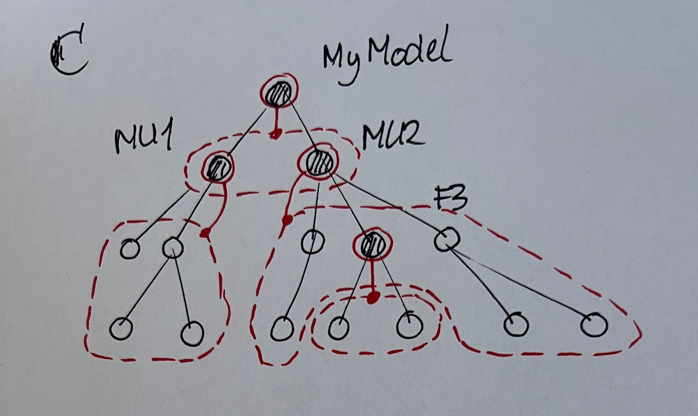

after writing [definitions and explanations](definitions-and-explanations.md) I studied the article "A Theory of Name Resolution" . [(Neron et.al 2015)](original-publications/978-3-662-46669-8_9.pdf)
This has lead to new insights which I capture here.

# Introduction

to set the stage, here is a quote from  page 206
`<quote>`
**Formalizing Resolution**. This paper describes a formalism that we believe can help play a similar role for name resolution in lexically-scoped languages. It consists of a *scope graph*, which represents the naming structure of a program, and a *resolution calculus*, which describes how to resolve references to declarations within a scope graph. 
The **scope graph** abstracts away from the details of a program AST, leaving just the information relevant to name resolution. Its nodes include name references, declarations, and “scopes,” which (in a slight abuse of conventional terminology) we use to mean minimal program regions that behave uniformly with respect to name resolution. Edges in the scope graph associate references to scopes, declarations to scopes, or scopes to “parent” scopes (corresponding to lexical nesting in the original program AST). 
The **resolution calculus** specifies how to construct a path through the graph from a reference to a declaration, which corresponds to a possible resolution of the reference. Hiding of one definition by a “closer” definition is modeled by providing an ordering on resolution paths. Ambiguous references correspond naturally to multiple resolution paths starting from the same reference node; unresolved references correspond to the absence of resolution paths. 
To describe programs involving explicit **name spaces**, the scope graph also supports giving names to scopes, and can include “import” edges to make the contents of a named scope visible inside another scope. The calculus supports complex import patterns including transitive and cyclic import of scopes
`</quote>`

## Scope is the Core Concept

The core concept is **scope**, not namespace. Namespace is a scope that happens to have a name. Having a name comes in handy when you need to have a reference to a scope, like import or inheritance. But there are plenty examples of anonymous scopes, such as in languages with a block structure, where a block introduces a new scope without a name. Lexical scoping is all about anonymous scopes.

How to define the notion of scope? In the above quote it says *minimal program regions that behave uniformly with respect to name resolution*. This is an informal definition that may serve as a starting point, but may need refinement later. A more formal definition below.

The quote above also says: *the **scope graph** abstracts away from the details of a program AST, leaving just the information relevant to name resolution. Its nodes include name references, declarations, and “scopes”.* 
I propose to rephrase this as
- a scope only contains nodes with a name and/or with a reference. other nodes are left out as they do not play a role in name resolution
- a scope is associated with a node in the AST, a so called scope node
- a scope graph is a graph over scope nodes.

Freon has the notion of *designate a node to be a namespace node*. I propose to replace that by *designate a node to be a scope node* . If the scope node has a name, then the scope also has this name and may be said to be a namespace. A scope node and a scope are different notions. A scope is a set of nodes. 

When you designate a node to be a scope node, you have to define what nodes are in the set. OPEN ISSUE: is this definition the same for all scope nodes? For example: all descendants that are declarations or references, with the exclusion of nodes in descendant scopes. see diagram C. This seems to be a reasonable default. Alternatively, for each node you designate a scope node, you have the freedom to define membership of the scope. Too early to tell if this has value.

Here is a more formal definition of scope page 211
`<quote>`
A scope is an abstraction over a group of nodes in the abstract syntax tree that behave uniformly with respect to name resolution. Each program has a scope graph G, whose nodes are a finite set of scopes S(G). Every program has at least one scope, the global or root scope. Each scope S has an associated finite set D(S) of declarations and finite set R(S) of references (at particular program positions), and each declaration and reference in a program belongs to a unique scope. A scope is the atomic grouping for name resolution: roughly speaking, each reference xR i in a scope resolves to a declaration of the same variable xD j in the scope, if one exists. Intuitively, a single scope corresponds to a group of mutually recursive definitions.
`</quote>`
This does not bring any new insights.

## Constructing the Scope Graph

Once scopes are defined, you may construct a scope graph on top of this. Edges in this graph may be used to express
- lexical scoping
- inheritance
- import
Is this the list of scope graph construction primitives? maybe this is more a list of scope graph patterns that have emerged historically -- where each pattern might be constructed using a smaller set of  primitives. Too early to tell.

## Resolution Calculus

OPEN ISSUE Is the resolution calculus of Freon is fixed at this time?

It seems that not only the name must be matched, but also the concept mentioned in the reference property. OPEN ISSUE: what are the rules for matching on type? concept inheritance and interfaces play a role here.

# Terminology Entries

given the new insights, some entries need to be changed.

**namespace**
A namespace is a scope with a name. More precisely, given a named node that is designated to be a scope node, the scope is said to have the same name as the node.

**scope**
a set of nodes that behave uniformly with respect to name resolution. The set only includes name declarations and name references, other nodes are left out as they do not play a role in name resolution.

**scope node**
a node may be designated as a scope node. this means that the node is associated with a scope which is a set of nodes. Note that scope node and scope are not the same thing.
By default the only scope node is the root node of the AST aka model node. In the scoper aspect, you may designate additional nodes to be scope nodes. For details see Explanation / Scopes

**reference resolution**
reference resolution works like this: search for a node 
- of the right concept and with the right name
- by visiting an ordered list of scopes, one at at time, where the list is derived from the scope graph
- where the first hit wins
For details see Explanation / Reference Resolution

