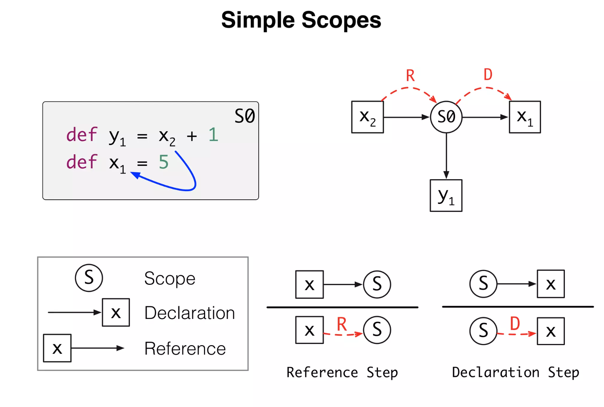

this document is to become an annotated reference

## references yet to be annotated

source: email from Jos Warmer to Jennek Geels

[https://www.youtube.com/watch?v=u1JfYa413fY](https://www.youtube.com/watch?v=u1JfYa413fY) 
presentation using the curry0n-2017 slides (see below)

[https://tudelft-cs4200-2020.github.io/lectures/2020/05-name-binding/CS4200-2020-5-name-binding.pdf](https://tudelft-cs4200-2020.github.io/lectures/2020/05-name-binding/CS4200-2020-5-name-binding.pdf)

[https://www.slideshare.net/slideshow/name-binding-with-scope-graphs/57237544](https://www.slideshare.net/slideshow/name-binding-with-scope-graphs/57237544) 
very long, has examples (later in the presentation) that might be useful.

 [https://eelcovisser.org/talks/2017/2017-06-curryon/scope-graphs-curryon-2017-06-20.pdf](https://eelcovisser.org/talks/2017/2017-06-curryon/scope-graphs-curryon-2017-06-20.pdf "https://eelcovisser.org/talks/2017/2017-06-curryon/scope-graphs-curryon-2017-06-20.pdf")

 [https://eelcovisser.org/publications/2018/AntwerpenPRV18.pdf](https://eelcovisser.org/publications/2018/AntwerpenPRV18.pdf)

## A Theory of Name Resolution

source
https://link.springer.com/chapter/10.1007/978-3-662-46669-8_9
copy in this repo
[original](original-publications/978-3-662-46669-8_9.pdf)

page 206: informal definition of scope
`<quote>`
“scopes,” which (in a slight abuse of conventional terminology) we use to mean minimal program regions that behave uniformly with respect to name resolution
`</quote>`

page 206: longer quote that seems a good introduction
`<quote>`
**Formalizing Resolution**. This paper describes a formalism that we believe can help play a similar role for name resolution in lexically-scoped languages. It consists of a *scope graph*, which represents the naming structure of a program, and a *resolution calculus*, which describes how to resolve references to declarations within a scope graph. 
The **scope graph** abstracts away from the details of a program AST, leaving just the information relevant to name resolution. Its nodes include name references, declarations, and “scopes,” which (in a slight abuse of conventional terminology) we use to mean minimal program regions that behave uniformly with respect to name resolution. Edges in the scope graph associate references to scopes, declarations to scopes, or scopes to “parent” scopes (corresponding to lexical nesting in the original program AST). 
The **resolution calculus** specifies how to construct a path through the graph from a reference to a declaration, which corresponds to a possible resolution of the reference. Hiding of one definition by a “closer” definition is modeled by providing an ordering on resolution paths. Ambiguous references correspond naturally to multiple resolution paths starting from the same reference node; unresolved references correspond to the absence of resolution paths. 
To describe programs involving explicit **namespaces**, the scope graph also supports giving names to scopes, and can include “import” edges to make the contents of a named scope visible inside another scope. The calculus supports complex import patterns including transitive and cyclic import of scopes
`</quote>`

the paper uses the term α-equivalence. internet search gives:
Alpha-equivalence is **a notion of equivalence on terms with binding structure**. It captures the notion that the names of bound variables are unimportant; all that matters is the binding structure they induce.

## name binding with scope graphs

[https://www.slideshare.net/slideshow/name-binding-with-scope-graphs/57237544](https://www.slideshare.net/slideshow/name-binding-with-scope-graphs/57237544)

More screen shots to follow